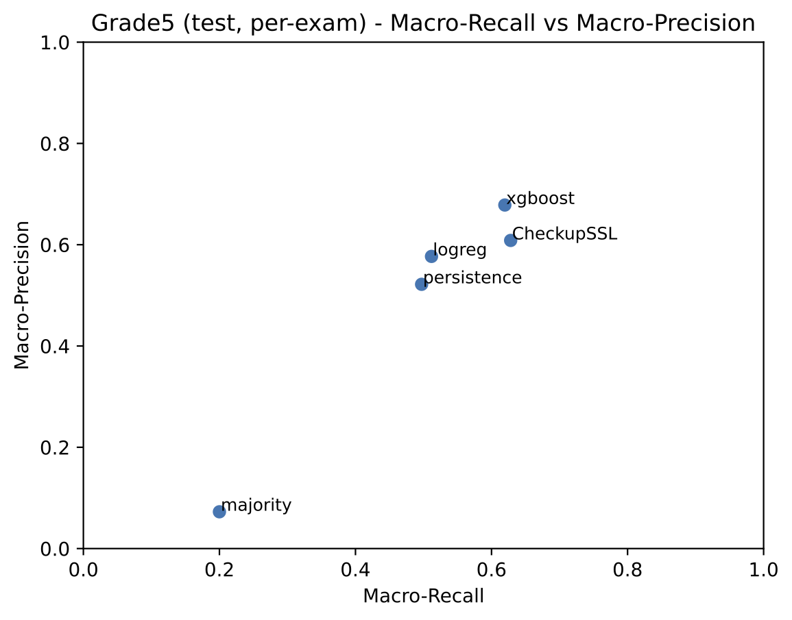
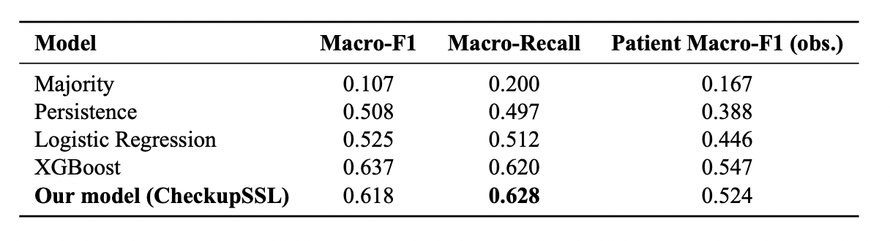
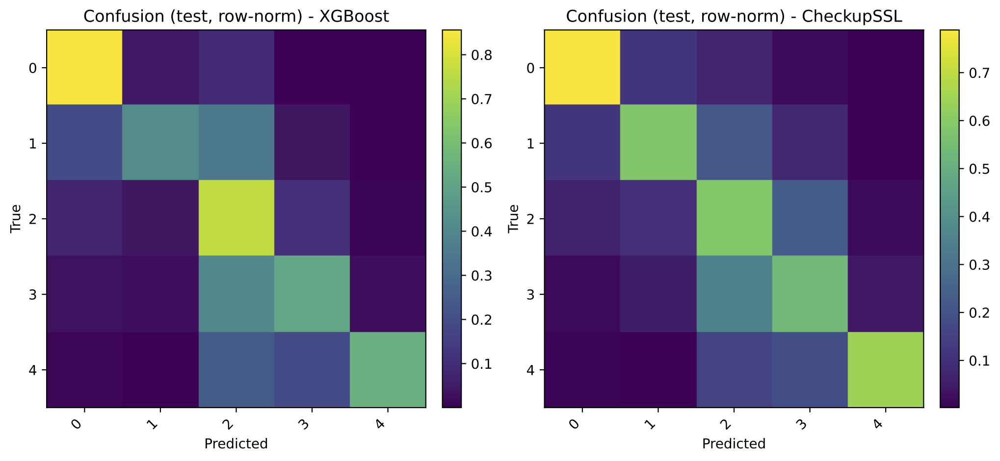
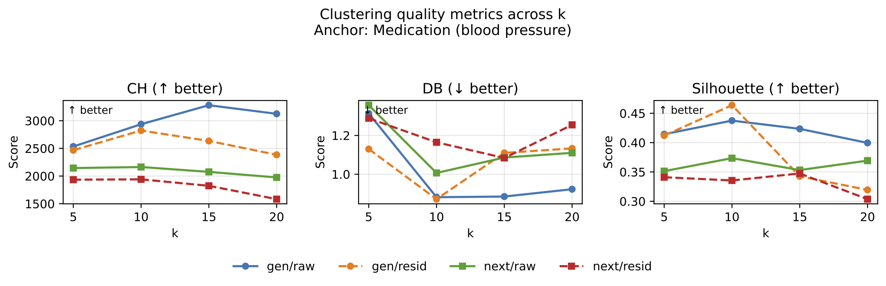
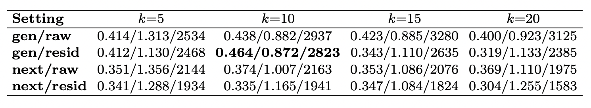
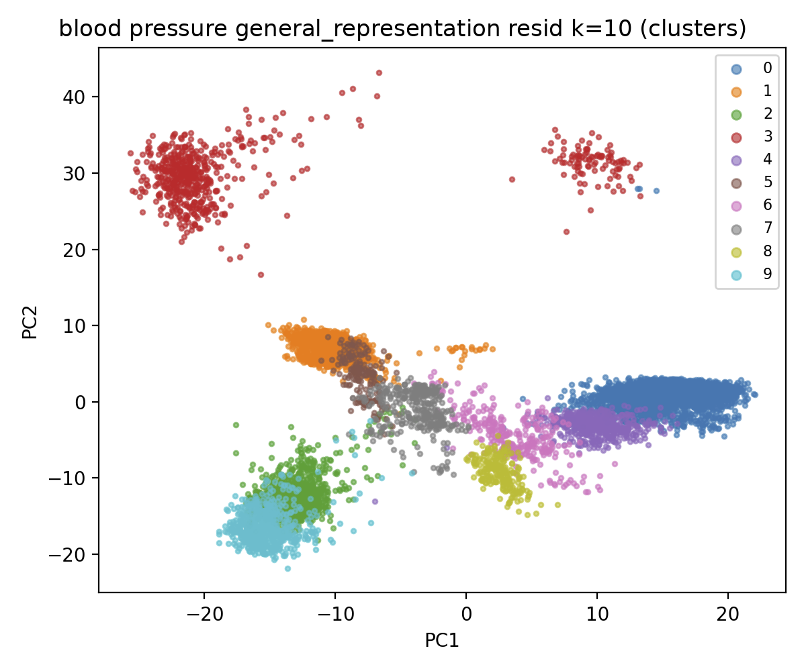
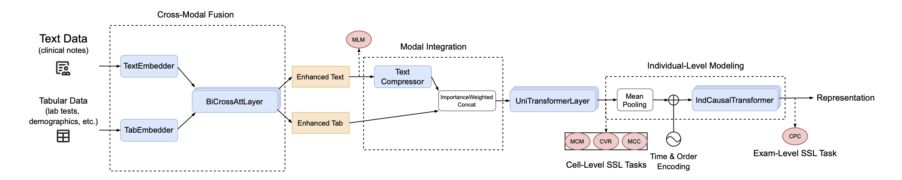
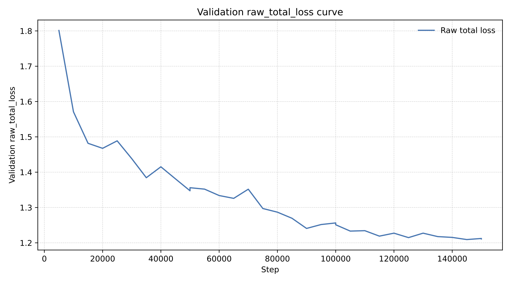

# Representation Learning of Health Checkup Data (CheckupSSL)

Health checkup records are longitudinal, heterogeneous, and often weakly labeled, combining sparse tabular lab-test entries with optional physician summaries.
This repository implements CheckupSSL, a hierarchical multimodal self-supervised framework that learns exam- and individual-level representations via cross-modal fusion and trajectory modeling.
We attach self-supervised objectives at multiple granularities (MLM, MCM, CVR, MCC, and CPC) and evaluate transfer via Grade5 prediction and incident-anchored representation clustering.
Experiments use the NTT Precision Medicine health checkup dataset; the underlying data and trained checkpoints are not included and are not publicly released.

This repository contains code and materials from my Master’s thesis project (2025–2026) at the University of Tokyo. More broadly, this work is a first step toward representation learning for real-world tabular data, using health checkup records as a concrete and clinically relevant instance. I implemented the core model and experiment pipeline (training, downstream evaluation, and analysis) used to produce the results shown below. This work is intended as a first step: the current model should be viewed as a baseline, with substantial room for improvement.

## Data & Availability

- **Data source**: NTT Precision Medicine health checkup dataset.
- **Scale (coarse)**: 34M+ lab-test records, tens of thousands of individuals, multi-decade follow-up.
- **Modalities**: per-exam tabular lab-test entries and optional physician summaries (Japanese in our setting; missing for some exams).
- **Not included / not released**: raw/processed data, derived manifests, trained checkpoints/weights.
- **Privacy**: the codebase includes de-identification and PHI-handling utilities; see `scripts/data_preparation/deidentify_data.py` and `config/cleaning/*phi*`.

## Selected Results

Reported from internal thesis experiments on the NTT Precision Medicine health checkup dataset; reproducing exact numbers requires dataset access and the corresponding checkpoints.

### Grade5 prediction

Takeaways (test split):
- XGBoost achieves the best overall Macro-F1, while CheckupSSL remains competitive and improves substantially over weaker baselines.
- The recall–precision scatter highlights a trade-off: CheckupSSL favors macro-recall, while XGBoost favors macro-precision.
- Confusions concentrate among neighboring categories (row-normalized confusion matrices), consistent with the ordinal nature of the labels.

### Incident-anchored clustering (exploratory)

This clustering analysis is exploratory: we do not claim clinically validated phenotypes. Instead, we use robustness/sensitivity checks—varying the embedding choice, demographic residualization, and the number of clusters—to assess how stable the observed grouping structure is under reasonable design choices.

Legend for the metrics table:
- `gen` / `next`: trajectory-summary vs. next-step–oriented embeddings.
- `raw` / `resid`: without vs. with demographic residualization.
- Cells report **Silhouette / Davies–Bouldin / Calinski–Harabasz** (higher / lower / higher is better).

Takeaways:
- Learned embeddings exhibit coherent structure under unsupervised clustering on a medication anchor cohort, serving as an exploratory probe of representation geometry.
- Clustering quality varies meaningfully with representation choice, residualization, and k.
- PCA visualizations show multiple separated subgroups in a representative setting.

## Method at a Glance

CheckupSSL integrates two modalities at the exam level (tabular lab-test entries and optional summaries), then models longitudinal structure across an individual’s exam trajectory.

Self-supervised objectives:
- **MLM**: masked language modeling on summary text.
- **MCM / MCC / CVR**: cell-level objectives tailored to categorical / multiple-choice / continuous-value reconstruction.
- **CPC**: exam-level contrastive predictive coding for next-exam prediction along trajectories.

Configuration snapshot (thesis experiments):
- Representation dimension: `d_model = 768`.
- Architecture: 2 cross-modal fusion layers (BiCrossAtt) + 10 unified transformer layers + a 2-layer causal Transformer over an individual’s exam trajectory.
- Text processing: a domain-pretrained RoBERTa-style embedder (max length 512) with fixed-length text compression to 50 summary tokens.
- Model size (thesis setup): backbone (encoder + 3 embedders) has 146.2M parameters; the full pretraining model (backbone + heads + MultiTaskLoss) has 169.9M parameters (all trainable).
- Full training and architecture details are specified in `config/experiments/ssl_pretraining_v1_*.yaml`.

Training stability example:

Missing-modality handling (baseline): exam-level summary text may be absent for a subset of exams. In data loading, missing summaries are represented as empty sequences and padded with an all-zero attention mask, so downstream text modules ignore them and such samples do not contribute to the MLM objective. In multimodal fusion, the model degrades to unimodal computation when text is missing by suppressing cross-attention updates (i.e., effectively setting the cross branch weight to zero), ensuring robustness while remaining a conservative baseline with clear room for more sophisticated missing-modality strategies.

## Repository Map

- `src/models/`: datasets, collate, embedders, fusion/transformers, core model (`MedicalSSLModel`).
- `src/training/`: SSL trainer, objective heads, multi-task losses, callbacks, monitoring.
- `src/downstream/`: Grade5, lab-test prediction, incident-anchored phenotyping utilities.
- `scripts/`: training, representation export, phenotyping/clustering, profiling, and data preparation utilities.
- `config/`: experiment configs (`config/experiments/`), downstream configs (`config/downstream/`), splitting/cleaning/HPO configs.
- `tests/`: unit tests for model/data/training utilities.

## Running the Code (requires access)

This repository is config-driven. Scripts are designed to be run from the project root.

### Environment

- Create the conda environment from `environment.yml`:
  - `conda env create -f environment.yml`
  - `conda activate project`

### (Optional) Cache the default text model

- `python scripts/embedders/cache_default_models.py`

### (Optional) Pretokenize summary text

- `python scripts/embedders/pretokenize_data.py --source_path <result.parquet> --output_dir cache/pretokenized/`

### SSL pretraining

- `python scripts/train_ssl.py --config config/experiments/ssl_pretraining_v1_full.yaml`

Related configs:
- `config/experiments/ssl_pretraining_v1_base.yaml`
- `config/experiments/ssl_pretraining_v1_full_hpo.yaml`

### Export representations

- `python scripts/downstream/export_ssl_representations.py --config <DOWNSTREAM_CONFIG.yaml> --output_path <OUT.parquet>`

### Downstream: Grade5

- `python scripts/train_grade5.py --config config/downstream/grade5_task_config_v1.yaml`

### Downstream: lab-test prediction

- `python scripts/train_lab_test.py --config config/downstream/lab_test_task_config_v1.yaml`

### Phenotyping: incident-anchored representations and clustering

- Extract representations: `python scripts/downstream/phenotyping/incident_anchored/extract_representations.py --config config/downstream/incident_anchored_repr_config.yaml`
- Cluster: `python scripts/downstream/phenotyping/incident_anchored/cluster_representations.py --config config/downstream/incident_anchored_clustering_config.yaml`
- Evaluate: `python scripts/downstream/phenotyping/incident_anchored/evaluate_clustering.py --config config/downstream/incident_anchored_clustering_config.yaml`

### Expected data schema (high-level)

The pipeline expects Parquet inputs with a small set of stable join keys. Modality joins are performed at day granularity.

- **Split manifest** (`data/.../*.parquet`): required columns `exam_id` (string), `person_id` (string), `ExamDate` (date).
- **Tabular exam entries** (mcinfo; per-exam `tests`):
  - **Recommended**: a *materialized* Parquet aligned to the manifest row order; it may contain only a `tests` column. Row count and row order must match the manifest (optional footer validation is supported).
  - Alternative: a hive-partitioned Parquet dataset (partitioned by year) containing `exam_id` and `tests`.
  - `tests` schema: `list<struct<code: string, name: string, value_num: double, value_cat: string, value_text: string, unit: string, type: string>>`, where `type` indicates the value modality (numerical / categorical / short text).
- **Demographics** (`data/.../*.parquet`): required columns `person_id`, `BirthYear`, `Gender`.
- **Physician summaries** (optional; code naming: `result` / `interview`):
  - Raw text table: `AnonymousID`, `McExamDt`, and a text column (e.g., `ResultText`).
  - Pretokenized table: `AnonymousID`, `McExamDt`, `input_ids`, `attention_mask`.
  - Identifier/date convention: `person_id` matches `AnonymousID` (after string conversion), and `ExamDate` aligns with `McExamDt` at day granularity.

We intentionally omit cohort-construction specifics, thresholds, and sensitive dataset statistics in this public repository.

## Testing

- Run unit tests: `python -m pytest -q`
- Tests are designed to run on CPU; a small number of GPU-specific tests are skipped when CUDA is unavailable.
- Some optimization tests are skipped unless local dataset artifacts (manifests/materialized mcinfo/pretokenized text) are present.

## Acknowledgements

- I thank Yoichiro Kamatani, Masaru Koido, and Yohei Takeuchi for supervision and discussions.
- Computations were supported by the Human Genome Center, the Institute of Medical Science, the University of Tokyo (http://sc.hgc.jp/shirokane.html).
- I thank NTT Precision Medicine for providing access to the health checkup dataset used in this study.

## Citation

If you use this code, please cite this repository via `CITATION.cff`.
